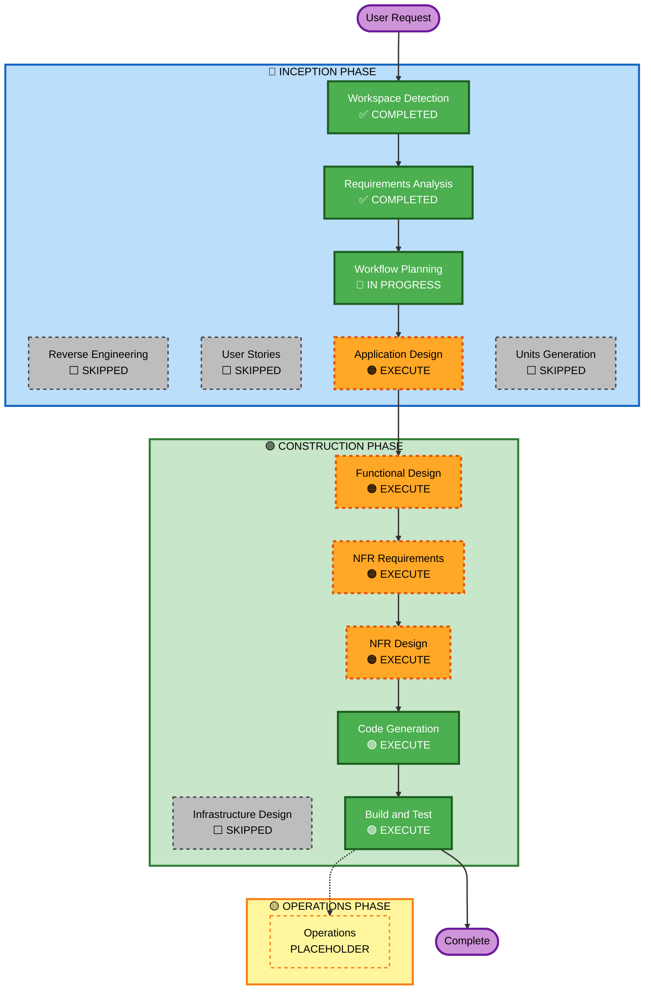

# Execution Plan — InsightForge

## Detailed Analysis Summary

### Change Impact Assessment
- **User-facing changes**: Yes — new Streamlit web application with chat UI and visualizations
- **Structural changes**: Yes — new multi-component Python application (6 source files + tests)
- **Data model changes**: Yes — new LangChain Document-based knowledge base from sales_data.csv
- **API changes**: No — no existing API being modified
- **NFR impact**: Yes — security (API key handling, input validation), PBT (Hypothesis tests), exception handling

### Risk Assessment
- **Risk Level**: Low — greenfield project, no migration or breaking changes
- **Rollback Complexity**: Easy — no existing system to break
- **Testing Complexity**: Moderate — LLM calls require mocking or API key in test environment

---

## Workflow Visualization



### Text Alternative
```
INCEPTION PHASE:
  ✅ Workspace Detection    — COMPLETED
  ⬜ Reverse Engineering    — SKIPPED (Greenfield)
  ✅ Requirements Analysis  — COMPLETED
  ⬜ User Stories           — SKIPPED (single-developer capstone)
  🔄 Workflow Planning      — IN PROGRESS
  🟠 Application Design     — EXECUTE
  ⬜ Units Generation       — SKIPPED (single unit, no decomposition needed)

CONSTRUCTION PHASE (single unit — InsightForge):
  🟠 Functional Design      — EXECUTE
  🟠 NFR Requirements       — EXECUTE
  🟠 NFR Design             — EXECUTE
  ⬜ Infrastructure Design  — SKIPPED (local app, no cloud infra)
  🟢 Code Generation        — EXECUTE (ALWAYS)
  🟢 Build and Test         — EXECUTE (ALWAYS)

OPERATIONS PHASE:
  ⬜ Operations             — PLACEHOLDER
```

---

## Phases to Execute

### 🔵 INCEPTION PHASE
- [x] Workspace Detection — COMPLETED
- [x] Reverse Engineering — SKIPPED (Greenfield project)
- [x] Requirements Analysis — COMPLETED
- [x] User Stories — SKIPPED
  - **Rationale**: Single developer capstone, clear requirements from PDF, no multi-persona acceptance criteria needed
- [x] Workflow Planning — IN PROGRESS
- [ ] Application Design — EXECUTE
  - **Rationale**: New multi-component application; component boundaries, methods, and service layer need definition before code generation
- [ ] Units Generation — SKIPPED
  - **Rationale**: Single cohesive application unit; all components are tightly coupled and developed together

### 🟢 CONSTRUCTION PHASE (single unit: InsightForge)
- [ ] Functional Design — EXECUTE
  - **Rationale**: New data models (Document structure, knowledge base schema), business logic (retrieval keyword mapping, statistics computation), PBT-01 property identification required
- [ ] NFR Requirements — EXECUTE
  - **Rationale**: Tech stack decisions needed (LangChain version, Hypothesis framework, Plotly, logging config); security and PBT extension rules require NFR documentation
- [ ] NFR Design — EXECUTE
  - **Rationale**: Security patterns (input validation, error handling, logging), PBT test strategy, and timeout/resiliency design need to be incorporated before code generation
- [ ] Infrastructure Design — SKIPPED
  - **Rationale**: Local Streamlit application; no cloud infrastructure, no IaC, no deployment resources
- [ ] Code Generation — EXECUTE (ALWAYS)
  - **Rationale**: 6 source files + test suite + configuration files to generate
- [ ] Build and Test — EXECUTE (ALWAYS)
  - **Rationale**: Build setup, unit tests, integration test instructions needed

### 🟡 OPERATIONS PHASE
- [ ] Operations — PLACEHOLDER
  - **Rationale**: Future deployment workflows; out of scope for this capstone

---

## Estimated Timeline
- **Total Stages to Execute**: 7 (Application Design, Functional Design, NFR Requirements, NFR Design, Code Generation ×2, Build and Test)
- **Single Unit**: InsightForge (all components in one code generation pass)

## Success Criteria
- **Primary Goal**: Working InsightForge Streamlit app that answers business data questions via RAG
- **Key Deliverables**: 6 Python source files, requirements.txt, .env.example, pytest + Hypothesis test suite
- **Quality Gates**: Security rules SECURITY-03/05/09/10/12/15 compliant; PBT tests via Hypothesis; no hardcoded secrets
